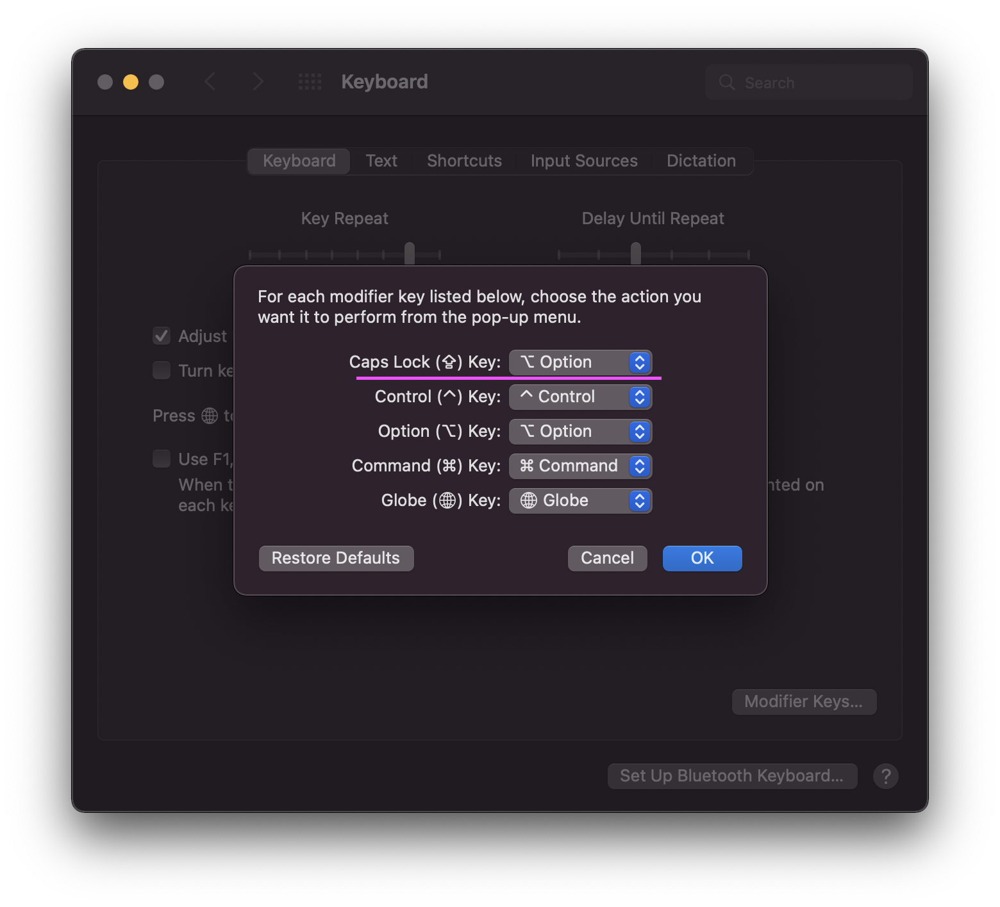

# German Umlaut QWERTY

A manual to use a QWERTY layout with German umlauts (ö,ä,ü) with a Mac. Pressing the option key + the letter (a, o, u) will return (ä, ö, ü).

## 1. Install the layout

You can download it [here](./assets/german-umlaut-keyboard-layout.keylayout).

## 2. Switch to the layout

1. Open settings
2. Open keyboard
3. Open the tab Input sources
4. Select "dutch copy"

## 3. Use CAPSLOCK for the umlauts

I find it quite handy to modify the CAPSLOCK key to be the option key. Try it out yourself. To do so:

1. Open settings
2. Open keyboard
3. Open (or stay in) the keyboard tab
4. Click on modifier keys
5. Modify the CAPSLOCK key to be the option key

